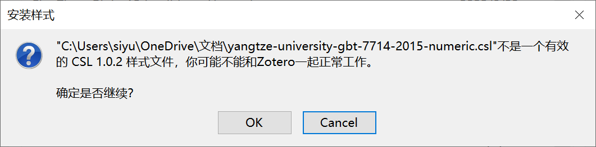
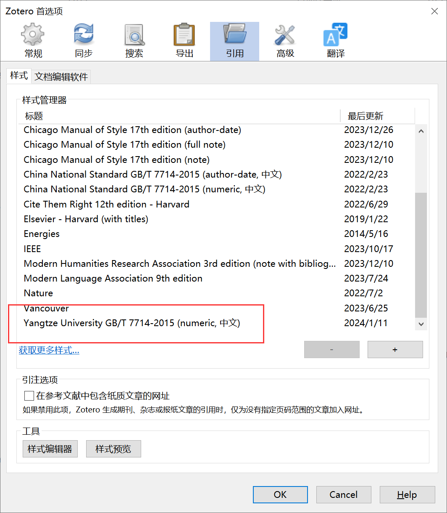

# YangtzeUniversityPaperCite
# 长江大学学位论文Zotero参考文献的样式
用于长江大学学位论文使用Zotero引用参考文献的样式文件
# 如何安装？
打开zotero -> 点击首选项 -> 点击引用 -> 点击样式 -> 点击获取更多样式 -> 加号 安装本项目的.cls文件
## 安装过程会遇到的问题

这是正常的，可以用

# 如何安装？
存在的问题： 发布于预印本网站 arXiv 上的文章保留了论文的链接，不符合规定，本人能力有限，欢迎各位大佬校友积极参与改进