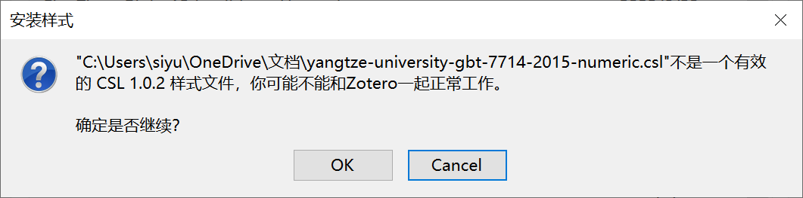
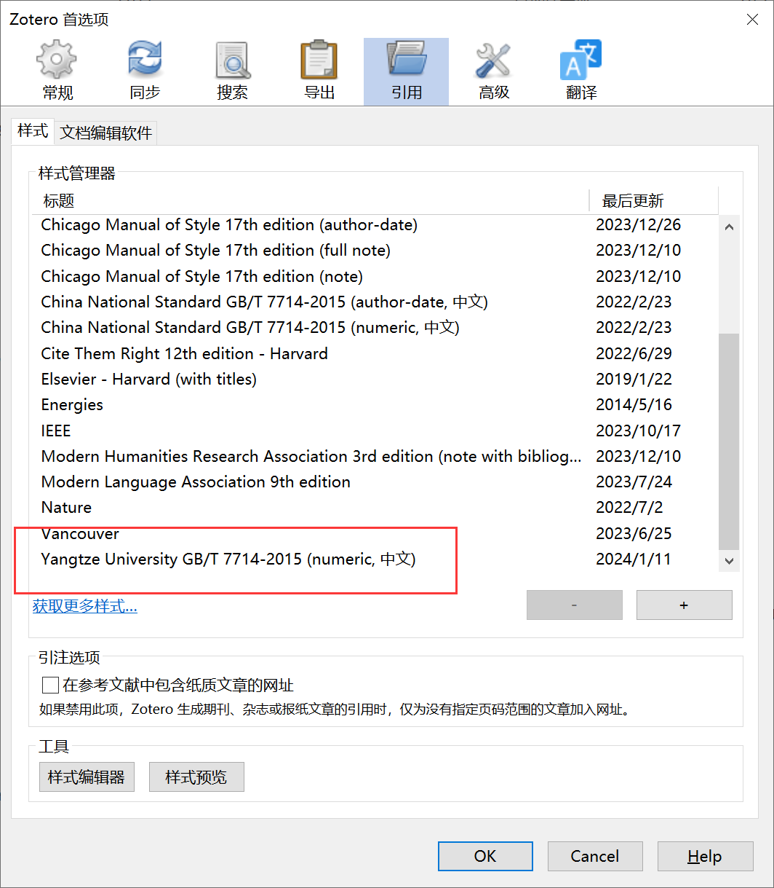
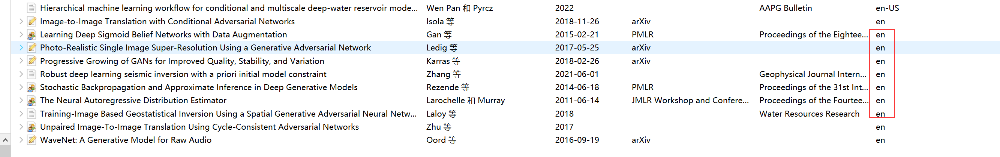

# YangtzeUniversityPaperCite
# 长江大学学位论文Zotero参考文献的样式
用于长江大学学位论文使用Zotero引用参考文献的样式文件
# 如何安装？
打开zotero -> 点击首选项 -> 点击引用 -> 点击样式 -> 点击获取更多样式 -> 加号 安装本项目的.cls文件
## 安装过程会遇到的问题

这是正常的，可以用

# 可能会出现的问题
英文期刊出现 moumoumou“等”，例如arXiv上的文章，需要手动将论文的语言改为‘en’

# 缺陷
存在的问题： 发布于预印本网站 arXiv 上的文章保留了论文的链接，不符合规定，本人能力有限，欢迎各位大佬校友积极参与改进
例如：
### 修改前的文献
[1]Mirza M, Osindero S. Conditional Generative Adversarial Nets[J]. arXiv, 2014. http://arxiv.org/abs/1411.1784.
### 修改后的文献（使用谷歌学术搜索生成的引用）
[1]Mirza M, Osindero S. Conditional generative adversarial nets[J]. arXiv preprint arXiv:1411.1784, 2014.

# Latex模板
GitHub上面发现的[Latex模板](https://github.com/gis-xh/Yangtzeu_Template)不过感觉很不成熟